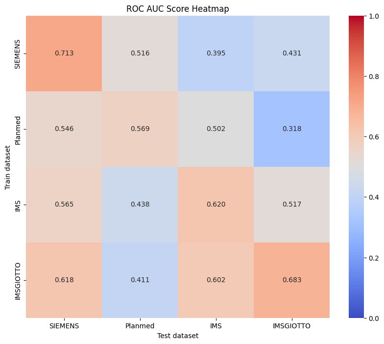
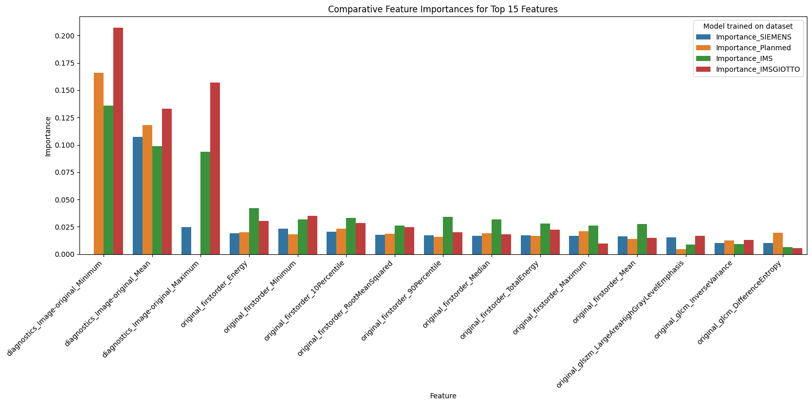

# cross-device-model-testing

Cross-vendor evaluation of machine learning models in medical imaging.  
Models are trained on data from one vendor’s device and tested on another to study robustness and generalization.

---

## Dataset

The dataset consists of medical imaging metadata and labels collected from **multiple manufacturers** (`SIEMENS`, `Planmed`, `IMS`, `IMS GIOTTO`).  
Each record contains identifiers, vendor information, image properties, and class labels.

---

## Data preprocessing and cleaning

A series of preprocessing steps were applied to prepare the dataset for training:

- **Loading optimization**: load once in Colab to avoid repeated delays.  
- **Column selection**: kept `study_id`, `image_id`, `Manufacturer`; removed non-numeric and irrelevant dimension columns.  
- **Class/feature adjustments**: overlap set to 0 for healthy samples; very small overlaps (<0.01) filtered out.  
- **Handling missing values**: columns with >2% NaN dropped.  
- **Splitting by manufacturer**: separate DataFrames for each vendor to enable cross-vendor evaluation.  
- **Exploratory analysis**: class balance checked (approximately even across classes).

---

## Model training and evaluation

- Base classifier: **Random Forest (100 trees)**.  
- Dataset split: **Train/Validation/Test by study_id (TVT)** to ensure no patient leakage.  
- Metrics: **ROC AUC** and **F1 Score** across all train/test combinations.  
- Feature importance extracted and compared across models.

---

## Results

### Cross-vendor performance (ROC AUC)

**Observations:**
- Models perform reasonably when trained and tested on the *same vendor* (diagonal values).  
- Performance drops drastically across vendors (off-diagonal), showing limited generalization.  
- **Planmed** results are especially poor:
  - Possible domain shift: imaging parameters or preprocessing pipelines differ significantly from other vendors.
  - Feature distributions may not align with those from Siemens/IMS/IMS Giotto, leading to poor transferability.

Note:  
Using **K-Fold stratified group splitting** gave higher diagonal scores, but this is misleading — folds can leak subtle patient-level or distributional information.  
Therefore, the stricter **TVT patient-level split** is more reliable for true generalization.

---

### Feature importance

**Key points:**
- A handful of radiomic/statistical features (e.g., `Minimum`, `Mean`, `Maximum`) consistently appear as most important across vendors.  
- The relative importance distribution shifts by manufacturer is further evidence of vendor-specific biases in feature distributions.  
- Aggregated importance ranking provides a stable view of which features drive model decisions across devices.

---

## Next steps

- Improve generalization with **domain adaptation** or **data harmonization** methods.  
- Use weighted coeff to combat overlapping issues and improve results in general
- Validate results on additional external datasets.